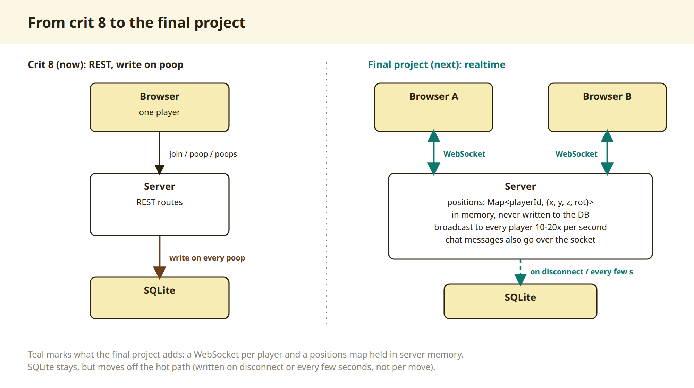
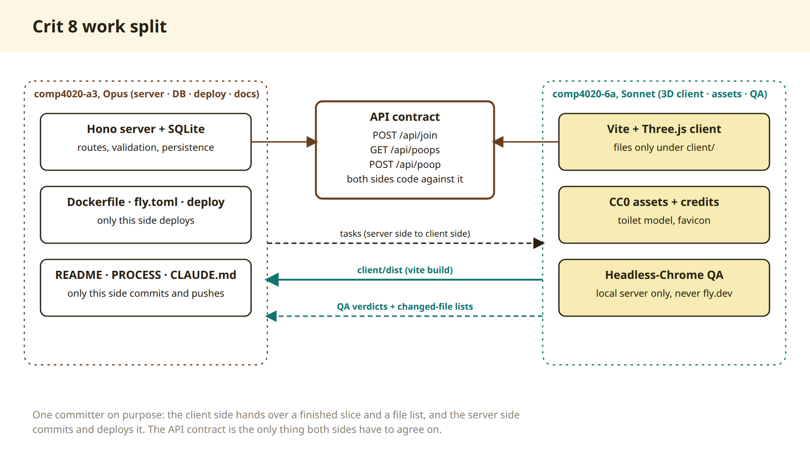

# Process overview

## Crit 9: everyone at once

Crit 8 was a toilet you could leave one poop in. This week it became live:
everyone in the room sees everyone else walk, jump and poop, within a tenth
of a second. Halfway through the week the project also changed direction,
from a joke toilet to a small ANU virtual campus. The real-time layer is what
made that change cheap.

## Why it changed direction

The poop was always a stand-in. The idea underneath, a place where people who
don't know each other have an excuse to meet, has a much sharper version at
ANU: students and academics almost never meet informally, so finding a
supervisor or a student for a lab depends on luck. A shared space with the
Student Hub, a stretch of campus and course classrooms gives them somewhere to
bump into each other. Before committing to it, I had the agent read the README
of every other public final-project repo in the course (108 of them) and tell
me only whether anyone was doing the same thing. One project is close, a few
partly overlap, so I'm keeping my angle on staff and students meeting rather
than campus places as such.

I also cut parts of my own plan once I knew what wasn't possible: Echo360 in
a classroom needs ANU login and can't be re-broadcast; real ANU sign-in isn't
available to a student app; chat translation needs a paid service. The full
order, and what this week takes from it, is in [`docs/plan.md`](docs/plan.md).

## Why WebSockets

Every open tab keeps one WebSocket to the one server. Positions live only in
the server's memory and go out ten times a second, and only when someone has
moved. A poop is still saved over HTTP, then broadcast to everyone the moment
it lands. A visitor's last spot reaches SQLite once, when they leave, so they
walk back in where they were.

I considered three alternatives:

- **WebRTC** (browser to browser) is built for voice and video. With no server
  in the path, the server can't log actions (crit 10 asks for exactly that),
  can't enforce rules like the poop cooldown, and can't save anything. It also
  needs a relay server on locked-down networks like campus Wi-Fi, and every
  person connects to every other. It may come back later for voice only, with
  the WebSocket doing its signalling.
- **Server-sent events** only go one way; every move would still need its own
  HTTP request back.
- **Polling** can't reach "within a second" for ten people moving at once
  without hammering one small machine.

I also kept the protocol generic: the server only knows "move" and "action",
not "poop", because the spaces and what people do in them are going to keep
changing.

## How I worked with the agent

**I plan in my own words first.** I keep a Korean planning document outside
the repo and update it before each step. The agent reviews it for what's
impossible or risky, and I decide. This week that review is what turned
"Echo360 in a classroom" into a question board.

**Two sessions, written down.** In crit 8 I split the work between two
sessions by instinct. This week I wrote the split into
[`docs/roles.md`](docs/roles.md), linked from `CLAUDE.md` so every session
reads it: an Opus main session owns the server, shared client files, deploys
and every commit; a Sonnet helper builds self-contained modules (this week the
keyboard key guide) and does local QA with several browsers. One committer
keeps the history readable.

**Corrections that became rules.**

- Poops kept vanishing. The final-project template's `fly.toml` doesn't set
  the database path that crit 7's did, so the database sat on the machine's
  wiped disk and reset on every deploy and every auto-stop. The image now sets
  it, and I checked by restarting the machine with a poop in place.
- Resetting the live database took several tries: a one-line command quoted
  through `flyctl ssh` was mangled, then a script path resolved from the wrong
  folder. It's now a script with an absolute path, `scripts/reset-db.ts`.
- Live testing goes through named test accounts only, never the spec suite,
  so the rooms people see aren't full of random names.

## Stack

Three.js for 3D in the browser; Hono on Node 24 serving the client, the API
and the WebSocket from one process; SQLite (Node's built-in `node:sqlite`) on
the Fly volume. I ruled out managed Postgres and Redis: they cost money, add
processes to one small machine, and with a single server there's nothing for
Redis to share. Colyseus would give me rooms out of the box, but my rooms are
simple enough that plain `ws` with one channel per space keeps the protocol in
my hands.

## History

Crit 9 (crit 8's history is in the [`crit-8`](https://github.com/comp4020-agentic-coding-studio/comp4020-final-passionleader/tree/crit-8) tag).

- [`1cb36a4`](https://github.com/comp4020-agentic-coding-studio/comp4020-final-passionleader/commit/1cb36a4): WebSocket layer on the server: live positions in memory, poops broadcast the moment they land, last spot saved on leaving.
- [`a83202c`](https://github.com/comp4020-agentic-coding-studio/comp4020-final-passionleader/commit/a83202c): the client shows everyone live; WASD + E to poop + Space to jump; keyboard key guide; centred cooldown notice.
- [`238efdf`](https://github.com/comp4020-agentic-coding-studio/comp4020-final-passionleader/commit/238efdf): `docs/roles.md`, the role split between the two parallel sessions, linked from `CLAUDE.md`.
- [`d25f697`](https://github.com/comp4020-agentic-coding-studio/comp4020-final-passionleader/commit/d25f697), [`aeb95ba`](https://github.com/comp4020-agentic-coding-studio/comp4020-final-passionleader/commit/aeb95ba): `scripts/reset-db.ts`, a file-based reset for the live database after quoted one-liners failed, then fixed to use an absolute path.
